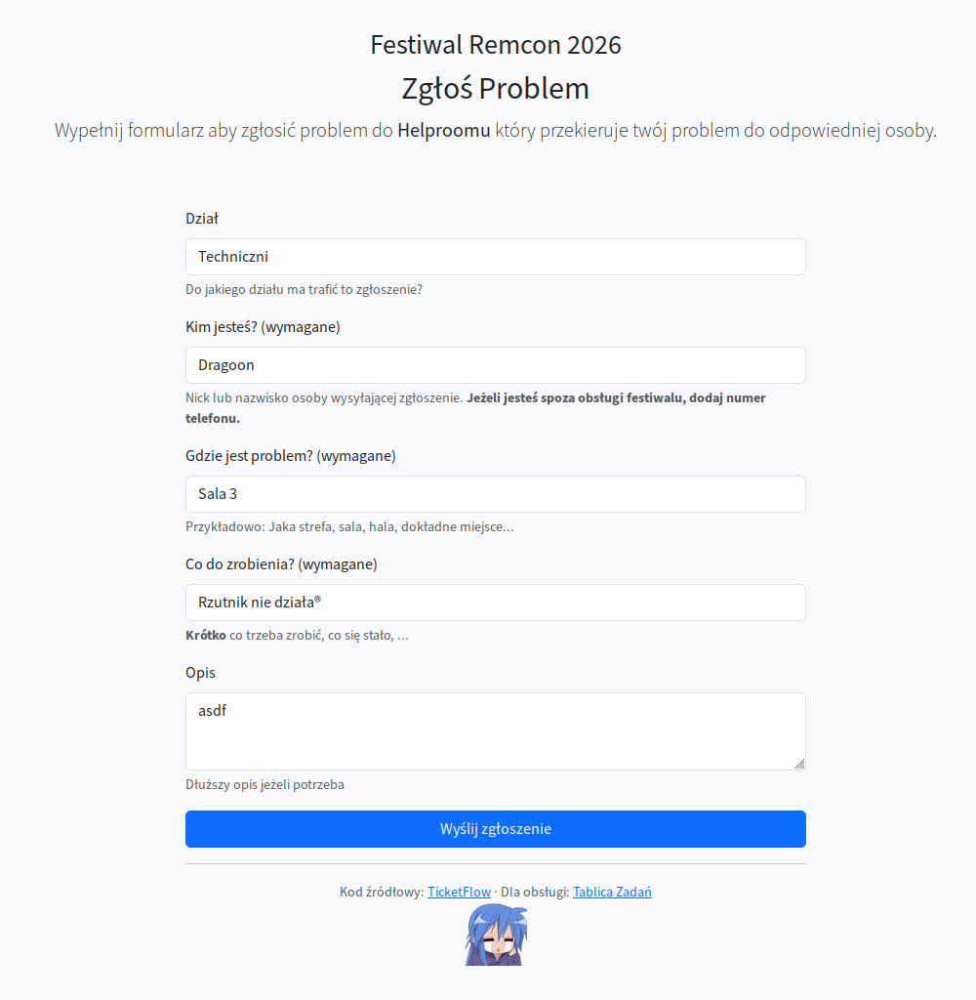
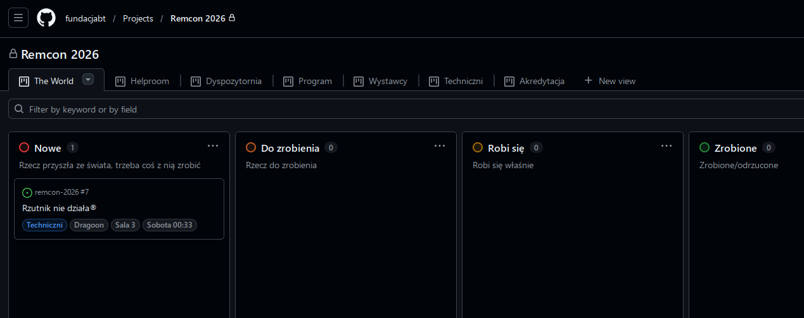
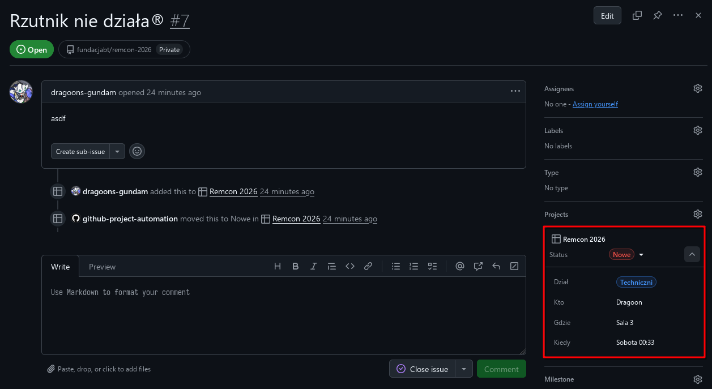

# TicketFlow

Mały formularz do przyjmowania ticketów ze świata jako issuesy w GitHubie + GitHub Projects.
Jak bardzo zmrużysz oczy, GitHub Projects to w sumie takie Trello, ale kosztuje uczciwą kwotę :D

Kod jest straszny i ledwo działa, ale działa. Ktoś kiedyś powinien to przepisać aby działało lepiej.

Ale dziś to nie jest ten dzień.

## Jak to wygląda







## Jak to złożyć

- Utwórz **organizację** na GitHubie
- Utwórz w tej organizacji puste repozytorium - to jest śmietnik do trzymania issuesów
  - Repo powinno być prywatne, w przeciwnym razie cały świat widzi tickety!
  - Możesz wyłączyć wszystkie ficzery GitHuba poza issuesami
  - Przykładowo: `fundacjabt/remcon-2026`
- Utwórz w tej organizacji projekt - to jest tablica ticketów
  - Jak wyżej, projekt również powinien być prywatny!
  - Po utworzeniu i otwarciu tablicy spisz z URLa numer projektu
  - Przykładowo: `Festiwal Remcon 2026` o numerze 3
- W ustawieniach projektu dodaj custom fieldy:
  - Nazwy pól **MAJĄ ZNACZENIE** - zmodyfikuj kod formularza jeśli chcesz nazwać je inaczej.
  - `Dział`: Single Select z działami do których można wysłać ticket.
    - Label text jest używany do filtrowania i jako ID działu
    - Description jest używany jako etykieta w formularzu
    - Jeżeli Description jest puste, dział nie wyświetla się w formularzu
    - Kolory nie mają znaczenia, oznacz je jak chcesz
    - Kolejność działów w tym menu odpowiada kolejności w formularzu
    - Pierwsza opcja na tej liście będzie domyślną w formularzu
  - `Kto`, `Gdzie`, `Kiedy`: pola tekstowe.
  - `Status`: skonfiguruj tak jak chcesz. Na Remconie mamy je złożone tak:
  - `Nowe`: Rzecz przyszła ze świata, trzeba coś z nią zrobić, człowiek jeszcze nie widział.
  - `Do zrobienia`: Trzeba coś z rzeczą zrobić, człowiek już widział i zaackował.
  - `Robi się`: Robi się właśnie.
  - `Zrobione`: Już się nie robi.
  - `Śmietnik`: Już się nie zrobi.
  - Kolory/opisy nie mają znaczenia dla formularza.
- Utwórz konto serwisowe do ładowania ticketów przez formularz.
  - Możesz użyć swojego prywatnego, ale dostaniesz kilkaset maili przez całe wydarzenie.
  - Upewnij się że konto ma dostęp minimum **Triage** do repo oraz **Write** do projektu.
  - Utwórz dla niego [token](https://github.com/settings/tokens) z uprawnieniami:
    - `repo` - do tworzenia issuesów
    - `project` - do zarządzania projektami i labelkami na nich
    - `read:org` i `write:org` - do zarządzania projektami i labelkami na nich (w orgu)
    - `read:user` - GraphQL bez tego zieje jadem T_T
- Odpal formularz na jakimś serwerze, na przykład używając komendy poniżej.
  - Ustaw env vary na wartości sensowne dla twojego wydarzenia.
- Spróbuj otworzyć i wysłać formularz - sprawdź czy ticket pojawił się na tablicy.
  - Pierwsze otwarcie formularza chwilę potrwa, pierwszy request zaciąga metadane do formularza z GitHuba.
  - Jeżeli zmienisz działy itp i chcesz aby formularz odwzorował te zmiany, zrestartuj aplikację.
  - Jak nic się nie pojawiło, przejrzyj logi czy coś poszło nie tak.
    - Użytkownik zwykle nie dostanie błędu na twarz - issuesy są tworzone jako zadanie w tle.

## Jak to odpalić (sam Docker/Podman)

Skopiuj plik `.env.example` z tego repo do lokalnego `.env` i pozmieniaj go pod twoje tokeny, repozytoria, itp. Dalej:

```bash
docker run --detach \
    -p 8080:8080 \
    -e HOST=0.0.0.0 \
    -e PORT=8080 \
    --env-file .env \
    --name ticketflow \
    ghcr.io/dragoonaethis/ticketflow
```

To wsio. Notatki:

- Domyślnie aplikacja używa 1 workera do obsługi requestów.
  - Wszystko co ciężkie odpala się w tle, poza pierwszym requestem.
  - Jeden worker wystarczy każdemu wydarzeniu mniejszemu niż Pyrkon.
- Nie wystawiaj tej aplikacji bezpośrednio do internetu po HTTP.
  - Postaw przed nią Caddy (łatwo) albo nginxa (trudniej) do serwowania HTTPSa.
  - Aplikacja ma domyślnie włączone `--proxy-headers` więc wystawianie jej bezpośrednio to słaby pomysł.
- Możesz podmontować inny `/app/static/favicon.webp` aby zmienić obrazek w stopce/faviconce.

## Jak to zalicencjonować

Projekt jest na licencji MIT, więc można brać i korzystać bez opłat i pytania.

Jeżeli projekt się przydał, autor chętnie przyjmuje [mailowo](mailto:ticketflow@dragonic.eu) dobre słowa i/lub wejściówki na wydarzenia z niego korzystające :)
